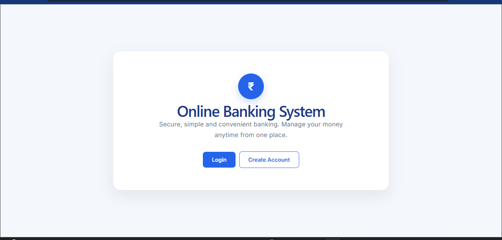
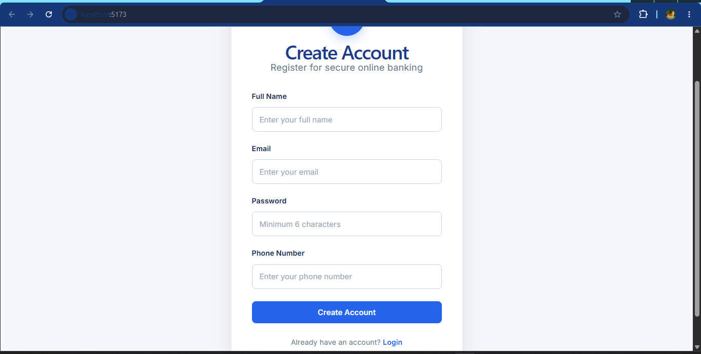
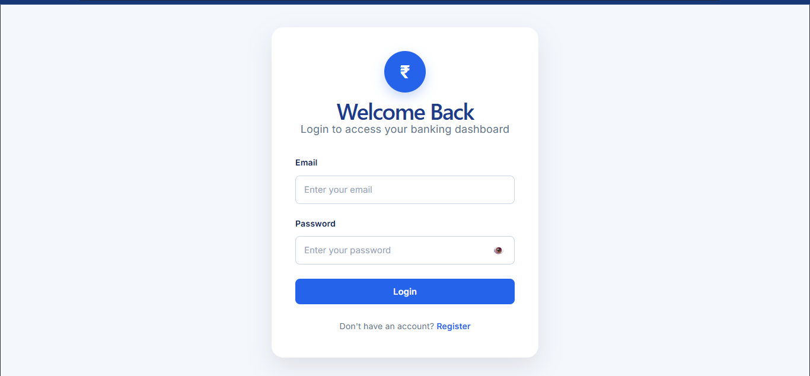
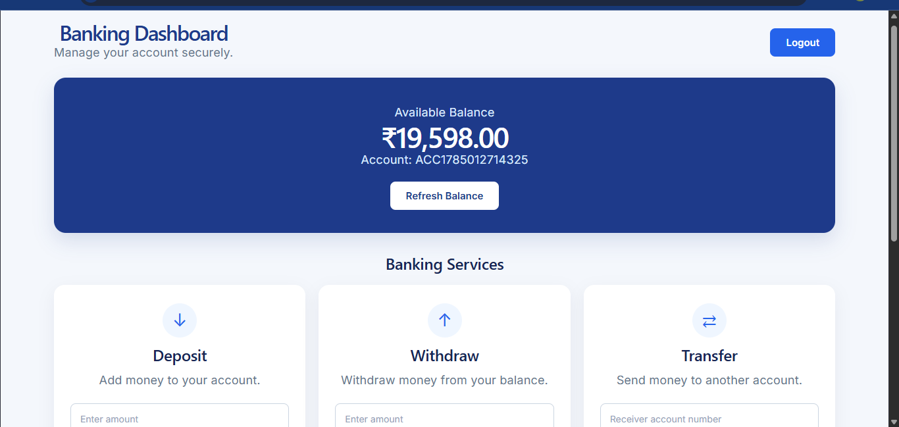
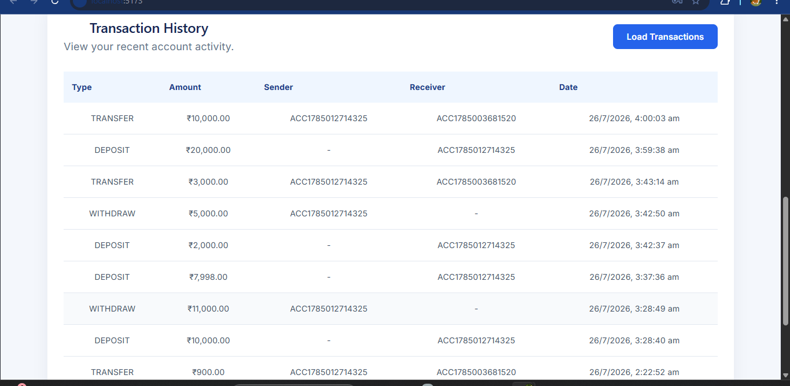

# 🏦 Online Banking System

A full-stack Online Banking System built using **Spring Boot, React, PostgreSQL, and JWT Authentication**.

The application allows users to securely create an account, log in, manage their bank balance, deposit and withdraw money, transfer funds to other accounts, and view transaction history.

---

## 🚀 Live Demo

🌐 **Frontend:** https://online-banking-system-zeta.vercel.app

⚙️ **Backend:** Deployed on Render

---

## ✨ Features

- User Registration
- Secure User Login
- JWT Authentication
- Password Encryption
- Protected Banking APIs
- Check Account Balance
- Deposit Money
- Withdraw Money
- Transfer Money Between Accounts
- Transaction History
- Input Validation
- Error Handling
- Logout
- Responsive User Interface
- Indian Rupee (₹) currency formatting

---

## 🛠️ Tech Stack

### Frontend

- React
- JavaScript
- HTML
- CSS
- Vite

### Backend

- Java
- Spring Boot
- Spring Security
- Spring Data JPA
- JWT Authentication
- Maven

### Database

- PostgreSQL

### Tools

- Git
- GitHub
- VS Code
- Postman
- pgAdmin

---

## 🔐 Authentication

The application uses **JWT (JSON Web Token)** authentication.

After a successful login, the backend generates a JWT token.

The frontend stores the token and sends it with protected API requests using:

`Authorization: Bearer <token>`

Spring Security validates the token before allowing access to protected banking endpoints.

---

## 💳 Banking Features

### Check Balance

Users can view their current account balance and account number.

### Deposit

Users can deposit money into their account.

The application prevents invalid or negative deposit amounts.

### Withdraw

Users can withdraw money from their account.

The system validates the available balance and prevents withdrawals when sufficient funds are not available.

### Transfer

Users can transfer money to another registered bank account using the receiver's account number.

The system updates the sender and receiver balances and records the transaction.

### Transaction History

Users can view their previous banking transactions, including:

- Transaction type
- Amount
- Sender account
- Receiver account
- Date and time

---

## 🔒 Security Features

- JWT-based authentication
- Spring Security
- Password encryption
- Protected REST APIs
- Stateless authentication
- Backend validation
- Frontend validation
- Authentication filter

---

## 📡 API Endpoints

### Authentication

| Method | Endpoint | Description |
|---|---|---|
| POST | `/auth/register` | Register a new user |
| POST | `/auth/login` | Login user |

### Account

| Method | Endpoint | Description |
|---|---|---|
| GET | `/api/account/balance` | Get account balance |
| POST | `/api/account/deposit` | Deposit money |
| POST | `/api/account/withdraw` | Withdraw money |
| POST | `/api/account/transfer` | Transfer money |
| GET | `/api/account/transactions` | View transaction history |

---

## 📁 Project Structure

```text
online-banking-system/
│
├── online-banking-frontend/
│   ├── src/
│   │   ├── App.jsx
│   │   ├── App.css
│   │   └── main.jsx
│   ├── package.json
│   └── vite.config.js
│
├── src/
│   └── main/
│       ├── java/
│       │   └── com/nibedita/online_banking_system/
│       │       ├── config/
│       │       ├── controller/
│       │       ├── dto/
│       │       ├── entity/
│       │       ├── repository/
│       │       ├── security/
│       │       └── service/
│       │
│       └── resources/
│
├── pom.xml
└── README.md
```
---

## 📸 Screenshots

### Home Page


### Register Page


### Login Page


### Banking Dashboard


### Transaction History
